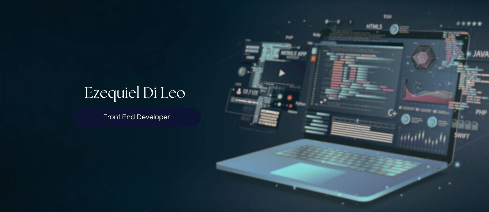

# Hey! Bienvenido al github de Ezequiel Di Leo.

Mi nombre es Ezequiel Di Leo.

📍Vivo en Buenos Aires, Argentina.

Me apasiona la tecnología y la programación.

👨🏼‍💻 Soy Frontend Developer especializado en Angular, y con experiencia trabajando para clientes aseguradoras. Poseo gran conocimiento de JavaScript y TypeScript que me permite crear aplicaciones web de alto rendimiento y funcionalidad.

🔍 Me siento cómodo trabajando en entornos dinámicos y resolviendo problemas técnicos de manera eficiente. Además, poseo una gran capacidad para adaptarme rápidamente a nuevas tecnologías, herramientas y a el equipo. Mi compromiso y dedicación me permiten asegurar resultados de alta calidad.

📌 Mi objetivo principal es seguir creciendo profesionalmente en el campo de la tecnología y poder adquirir la mayor cantidad de conocimientos.

### Tecnologias 💻:

<!--
**ezequielDiLeo/ezequielDiLeo** is a ✨ _special_ ✨ repository because its `README.md` (this file) appears on your GitHub profile.

Here are some ideas to get you started:

- 🔭 I’m currently working on ...
- 🌱 I’m currently learning ...
- 👯 I’m looking to collaborate on ...
- 🤔 I’m looking for help with ...
- 💬 Ask me about ...
- 📫 How to reach me: ...
- 😄 Pronouns: ...
- ⚡ Fun fact: ...
-->
